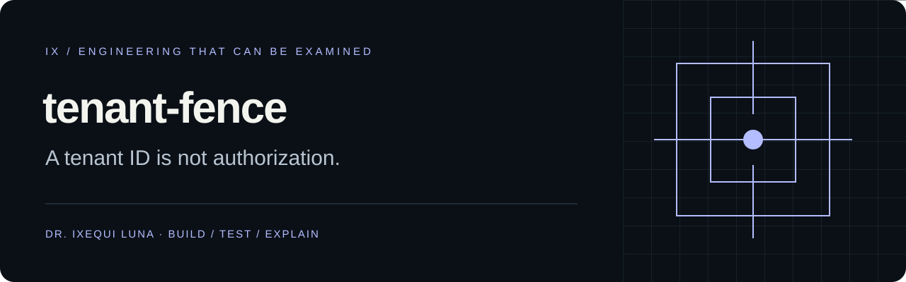

# tenant-fence

**Un identificador de empresa no es una autorización.**

Laboratorio que envía solicitudes HTTP reales a servicios sintéticos locales. Comprueba que cada organización puede leer sus registros y que no puede acceder a los de otra mediante IDs, encabezados falsificados o listados sin filtrar.

[English y referencia completa](README.md) · [Diseño](docs/DESIGN.md) · [Informe de ejemplo](docs/example-report.html)

```sh
python -m tenant_fence demo --out artifacts
```

Abre `artifacts/report.html`. Se ejecutan cinco servidores temporales: tres implementaciones con fallos, una con el alcance protegido y otra que deniega todo. Denegar a todos produce **INCONCLUSIVE**, porque tampoco funcionan los controles de acceso legítimo.

Para adaptar un servicio sintético propio, configura `examples/manifest.json`, sus dos variables de entorno de tokens y ejecuta `check --base-url http://127.0.0.1:8000 --manifest examples/manifest.json`. Solo admite HTTP en direcciones IP loopback, solicitudes GET y rutas acotadas. No sigue redirecciones ni utiliza proxies del sistema.

Códigos de salida: 0 aprobado, 1 fallo de frontera, 2 inconcluso o entrada inválida. Un 403 que incluya el marcador de otra organización sigue siendo un fallo.

No audita todos los permisos de una aplicación. No cubre escrituras, roles completos, archivos, WebSockets, RLS ni sistemas de producción. Python 3.11 o superior; sin dependencias de ejecución.

Autor: **Dr. Ixequi Luna**. Licencia MIT con atribución.
