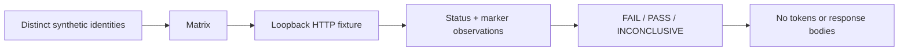

# Design and threat model

## Request matrix

Each configured identity reads its own detail and collection, attempts foreign detail reads, forges a tenant hint, and exercises anonymous access. A later identity reuses an earlier detail path, allowing a shared response cache to reveal a boundary failure. All probes are GET requests.

## Failure precedence

A detected foreign marker or an unauthorized successful response wins over missing controls. An outage cannot erase a proven violation. Otherwise, failed positive controls, redirects and transport errors make the experiment inconclusive. Denial requires 401, 403 or 404 without a foreign marker. Own-record controls require a 2xx response containing the expected marker and no foreign marker.

## Perimeter

Literal loopback IPs avoid DNS resolution surprises. HTTP redirects and environment proxies are disabled. Tokens are read from environment variables and never serialized into the report. The demo suppresses HTTP access logs. Response content is discarded after the bounded check; public reports expose only check numbers, categories, statuses and verdicts.

## Intentional trade-offs

This narrow target perimeter prevents remote staging/production audits. Two routes keep the adapter understandable but cannot prove every authorization boundary. Marker matching catches literal and JSON-escaped strings; it does not reconstruct arbitrary encodings. The socket timeout is not a whole-run real-time deadline. Fixture tokens are test identities, not a replacement for your authentication stack.

Before extending scope, add role and mutation contracts, explicit target authorization, bounded whole-run budgets and failure-mode tests. Never turn a missing own-record control into an accepted denial.
